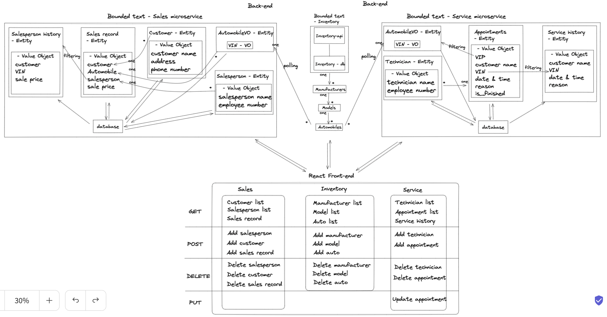

# CarCar

Team:

Person 1 - Service - Ailin Li
Person 2 - Sales - Gabriel Cruz

## How to Run this Application:

Construction steps:
    1. Fork and clone from GitLab
    2. Open Docker and run it in Docker containers.
        docker volume create beta-data
        docker-compose build
        docker-compose up
    3. In settings.py of the Sales and Service Django project: Install the sales_rest and service_rest application into their own INSTALLED_APPS and add "inventory-api" and "localhost" to ALLOWED_HOSTS
    4. Add "corsheaders.middleware.CorsMiddleware" in the MIDDLEWARE in both sales and service settings.py to ensure CORS works.
    5. Create superusers in inventory, sales and service and register admin.py of sales and service to make data editable in admin page.
    6. Add some manufacturer, model and automobile data in the admin
    7. In sales_rest/models, 
    8. In service_rest/models, create a AutomobileVO model to poll auto data from inventory-api, a technician model and an appointment model.
    9. make migrations
    10. Write view functions for GET, POST, PUT and DELETE for each feature.
    11. Write polling function in poller.py to poll automobile data from inventory-api
    12. Test from insomnia. The detailed API are in the API documentation below.
    13. Create REACT components, which are shown in the application diagram above.

Operation steps:
    1. Open browser at http://localhost:3000/ to see the main page
    2. On main page, click the "Inventory" on Navigation bar to reach the dropdown Nav link to manufacturer, model and automobile list page.
    3. On each list page in step 2, you can see an add new form button. Click the button to create a new one on its create form page.
    4. Once a new one is created, you will be redirected to the list page.
    5. On the manufacturer, model and automobile list page, you can also delete items by click the Delete button, and the page will be reloaded.
    6. Back to main page, click the "Service" on navigation bar to reach the dropdown Nav link to technician, appointment and service history page.
    7. On the technician and appointment list page, you can see an add new form button. Click the button to create a new one on its create form page.
    8. Once a new one is created, you will be redirected to the list page.
    9. On the list page, you can also delete items by click the Delete button, and the page will be reloaded.
    10. On the service history page, input the VIN on the search bar, and the service history of the car with that VIN will be loaded on this page.

## Application Diagram

## Services

This can either be a separate section with the services, their URLs, and ports listed here or you can include it in the application diagram

URLS:
    Home page: localhost:3000
  ## inventory:
    Manufacturers list:
        localhost:3000/manufacturers
    Create manufacturer form:
        localhost:3000/manufacturers/new
    Models list:
        localhost:3000/models
    Create model form:
        localhost:3000/models/new
    Automobiles list:
        localhost:3000/automobiles
    Create automobile form:
        localhost:3000/automobiles/new

  ## service:
    Technicians list:
        localhost:3000/technicians
    Create technician form:
        localhost:3000/technicians/new
    Appointments list:
        localhost:3000/appointments
    Create appointment form:
        localhost:3000/appointments/new
    Service history:
        localhost:3000/service-history

  ## sales:

Ports:
    react:
        - "3000:3000"
    sales-api:
        - "8090:8000"
    service-api:
        - "8080:8000"
    inventory-api:
        - "8100:8000"

## API Documentation
  # Inventory
    1. Manufacturer
        GET: Manufacturer list API: http://localhost:8100/api/manufacturers/
            Response: 	"manufacturers": [
                            {
                                "href": "/api/manufacturers/1/",
                                "id": 1,
                                "name": "RAM"},
                        ]
        GET: A specific manufacturer: http://localhost:8100/api/manufacturers/:id/
            Response:    {
                            "href": "/api/manufacturers/1/",
                            "id": 1,
                            "name": "Toyota"
                        }
        POST: A new manufacturer: 	http://localhost:8100/api/manufacturers/
                POST content:   {
                                    "name": "Honda"
                                }
            success response:   {
                                    "href": "/api/manufacturers/5/",
                                    "id": 5,
                                    "name": "Honda"
                                }
        PUT: a manufacturer: 	http://localhost:8100/api/manufacturers/:id/
                PUT content:    {
                                    "name": "NISSAN"
                                }
            success response:   {
                                    "href": "/api/manufacturers/8/",
                                    "id": 8,
                                    "name": "NISSAN"
                                }
        DELETE: a manufacturer: http://localhost:8100/api/manufacturers/:id/
            success response:   {
                                    "id": null,
                                    "name": "BMW"
                                }

    2. Model:
        GET: Model list API: http://localhost:8100/api/models/
            Response: 	"models": [
                            {
                                "href": "/api/models/1/",
                                "id": 1,
                                "name": "Sebring",
                                "picture_url": "https://upload.wikimedia.org/wikipedia/commons/thumb/7/71/Chrysler_Sebring_front_20090302.jpg/320px-Chrysler_Sebring_front_20090302.jpg",
                                "manufacturer": {
                                    "href": "/api/manufacturers/1/",
                                    "id": 1,
                                    "name": "RAM"
                                }
                            }
                        ]
        GET: A specific model: http://localhost:8100/api/models/:id/
            Response:   {
                            "href": "/api/models/1/",
                            "id": 1,
                            "name": "Sebring",
                            "picture_url": "https://upload.wikimedia.org/wikipedia/commons/thumb/7/71/Chrysler_Sebring_front_20090302.jpg/320px-Chrysler_Sebring_front_20090302.jpg",
                            "manufacturer": {
                                "href": "/api/manufacturers/1/",
                                "id": 1,
                                "name": "RAM"
                            }
                        }
        POST: A new model: 	http://localhost:8100/api/models/
                POST content:   {
                                    "name": "F-150",
                                    "picture_url": "https://encrypted-tbn0.gstatic.com/images?q=tbn:ANd9GcTmFghTxG4RJf69s09H4ESGR0GPiksQn2MiRA&usqp=CAU",
                                    "manufacturer_id": 3
                                }
            success response:   {
                                    "href": "/api/models/3/",
                                    "id": 3,
                                    "name": "F-150",
                                    "picture_url": "https://encrypted-tbn0.gstatic.com/images?q=tbn:ANd9GcTmFghTxG4RJf69s09H4ESGR0GPiksQn2MiRA&usqp=CAU",
                                    "manufacturer": {
                                        "href": "/api/manufacturers/3/",
                                        "id": 3,
                                        "name": "Ford"
                                    }
                                }
        PUT: a model: 	http://localhost:8100/api/models/:id/
                PUT content:    {
                                    "name": "Camry",
                                    "picture_url": "https://upload.wikimedia.org/wikipedia/commons/thumb/7/71/Chrysler_Sebring_front_20090302.jpg/320px-Chrysler_Sebring_front_20090302.jpg"
                                }
            success response:   {
                                    "href": "/api/models/7/",
                                    "id": 7,
                                    "name": "Camry",
                                    "picture_url": "https://upload.wikimedia.org/wikipedia/commons/thumb/7/71/Chrysler_Sebring_front_20090302.jpg/320px-Chrysler_Sebring_front_20090302.jpg",
                                    "manufacturer": {
                                        "href": "/api/manufacturers/1/",
                                        "id": 1,
                                        "name": "Toyota"
                                    }
                                }
        DELETE: a model: http://localhost:8100/api/models/:id/
            success response:   {
                                    "id": null,
                                    "name": "Mazda 6",
                                    "picture_url": "https://encrypted-tbn0.gstatic.com/images?q=tbn:ANd9GcRryXgJ11396QXgno41I6AcY1AW55PK1KPGww&usqp=CAU",
                                    "manufacturer": {
                                        "href": "/api/manufacturers/3/",
                                        "id": 3,
                                        "name": "Mazda"
                                    }
                                }

    3. Automobile:
        GET: Automobile list API: http://localhost:8100/api/automobiles/
            Response: 	"autos": [
                            {
                                "href": "/api/automobiles/9C4DD5CT6AN120195/",
                                "id": 1,
                                "color": "Grey",
                                "year": 2022,
                                "vin": "9C4DD5CT6AN120195",
                                "model": {
                                    "href": "/api/models/2/",
                                    "id": 2,
                                    "name": "Camry",
                                    "picture_url": "https://encrypted-tbn0.gstatic.com/images?q=tbn:ANd9GcRB35K0wsjwtHiexbwszqalkj0vHj-SjhkZsA&usqp=CAU",
                                    "manufacturer": {
                                        "href": "/api/manufacturers/4/",
                                        "id": 4,
                                        "name": "Toyota"
                                    }
                                }
                            },
                        ]
        GET: A specific auto: http://localhost:8100/api/automobiles/:vin/
            Response:    {
                            "href": "/api/automobiles/0195D5CT9C4D126AN/",
                            "id": 5,
                            "color": "Blue",
                            "year": 2020,
                            "vin": "0195D5CT9C4D126AN",
                            "model": {
                                "href": "/api/models/1/",
                                "id": 1,
                                "name": "Sebring",
                                "picture_url": "https://upload.wikimedia.org/wikipedia/commons/thumb/7/71/Chrysler_Sebring_front_20090302.jpg/320px-Chrysler_Sebring_front_20090302.jpg",
                                "manufacturer": {
                                    "href": "/api/manufacturers/1/",
                                    "id": 1,
                                    "name": "RAM"
                                }
                            }
                        }
        POST: A new auto: 	http://localhost:8100/api/automobiles/
                POST content:   {
                                "color": "Black",
                                "year": 2010,
                                "vin": "CT9C40195D5D126AN",
                                "model_id": 3
                                }
            success response:   {
                                    "href": "/api/automobiles/CT9C40195D5D126AN/",
                                    "id": 6,
                                    "color": "Black",
                                    "year": 2010,
                                    "vin": "CT9C40195D5D126AN",
                                    "model": {
                                        "href": "/api/models/3/",
                                        "id": 3,
                                        "name": "F-150",
                                        "picture_url": "https://encrypted-tbn0.gstatic.com/images?q=tbn:ANd9GcTmFghTxG4RJf69s09H4ESGR0GPiksQn2MiRA&usqp=CAU",
                                        "manufacturer": {
                                            "href": "/api/manufacturers/3/",
                                            "id": 3,
                                            "name": "Ford"
                                        }
                                    }
                                }
        PUT: an auto: 	http://localhost:8100/api/automobiles/:vin/
                PUT content:    {
                                "color": "blue",
                                "year": 2018
                                }
            success response:   {
                                    "href": "/api/automobiles/1C3CC5FB2AN120174/",
                                    "id": 1,
                                    "color": "blue",
                                    "year": 2018,
                                    "vin": "1C3CC5FB2AN120174",
                                    "model": {
                                        "href": "/api/models/1/",
                                        "id": 1,
                                        "name": "RAV4",
                                        "picture_url": "https://www.toyota.com/imgix/content/dam/toyota/jellies/max/2022/rav4/hybridse/4524/8w2/2.png?fm=webp&bg=white&w=768&h=328&q=90",
                                        "manufacturer": {
                                            "href": "/api/manufacturers/1/",
                                            "id": 1,
                                            "name": "Toyota"
                                        }
                                    }
                                }
        DELETE: an auto: http://localhost:8100/api/automobiles/:vin/
            success response:   {
                                    "href": "/api/automobiles/62784345675230119/",
                                    "id": null,
                                    "color": "White",
                                    "year": 2019,
                                    "vin": "62784345675230119",
                                    "model": {
                                        "href": "/api/models/1/",
                                        "id": 1,
                                        "name": "RAV4",
                                        "picture_url": "https://www.toyota.com/imgix/content/dam/toyota/jellies/max/2022/rav4/hybridse/4524/8w2/2.png?fm=webp&bg=white&w=768&h=328&q=90",
                                        "manufacturer": {
                                            "href": "/api/manufacturers/1/",
                                            "id": 1,
                                            "name": "Toyota"
                                        }
                                    }
                                }

  # Service
    1. Technician
        GET: A list of technicians: http://localhost:8080/api/technicians/
            Response: "technicians": [
                            {
                                "href": "/api/technicians/1/",
                                "technician_name": "Gabriel",
                                "employee_number": 56789,
                                "id": 1
                            },
                        ]
        GET: A specific technician: http://localhost:8080/api/technicians/:id/
            Response:    {
                            "href": "/api/technicians/1/",
                            "technician_name": "Harry",
                            "employee_number": 12345,
                            "id": 1
                        }
        POST: A new technician: http://localhost:8080/api/technicians/
                POST content:   {
                                    "technician_name": "Jess",
                                    "employee_number": 90123
                                }
            success response:   {
                                    "href": "/api/technicians/5/",
                                    "technician_name": "Jess",
                                    "employee_number": 90123,
                                    "id": 5
                                }
        DELETE: a technician: http://localhost:8080/api/technicians/:id/
            success response:   {
                                    "deleted": true
                                }
    2. Appointment
        GET: A list of appointment: http://localhost:8080/api/appointment/
            Response: 	"appointments": [
                            {
                                "href": "/api/appointments/1/",
                                "id": 1,
                                "consumer_name": "Marty",
                                "date": "2022-12-13",
                                "time": "09:00:00",
                                "reason": "Inspection check",
                                "vin": "16724567123458903",
                                "vip": false,
                                "is_finished": true,
                                "technician": {
                                    "href": "/api/technicians/3/",
                                    "technician_name": "Yuki",
                                    "employee_number": 78901,
                                    "id": 3
                                }
                            },
                        ]
        GET: A specific appointment: http://localhost:8080/api/appointments/:id/
            Response:   {
                            "href": "/api/appointments/1/",
                            "id": 1,
                            "consumer_name": "Marty",
                            "date": "2022-12-17",
                            "time": "09:00:00",
                            "reason": "Tire rotation",
                            "vin": "16724567123458903",
                            "vip": false,
                            "is_finished": false,
                            "technician": {
                                "href": "/api/technicians/3/",
                                "technician_name": "Yuki",
                                "employee_number": 78901,
                                "id": 3
                            }
                        }
        POST: A new appointment: http://localhost:8080/api/appointments/
                POST content:   {
                                    "consumer_name": "Matt",
                                    "vin": "67121672453458903",
                                    "date": "2022-12-18",
                                    "time": "11:00:00",
                                    "reason": "Regular service",
                                    "is_finished": false,
                                    "technician_id": 4
                                }
            success response:   {
                                    "href": "/api/appointments/4/",
                                    "id": 4,
                                    "consumer_name": "Matt",
                                    "date": "2022-12-18",
                                    "time": "11:00:00",
                                    "reason": "Regular service",
                                    "vin": "67121672453458903",
                                    "vip": false,
                                    "is_finished": false,
                                    "technician": {
                                        "href": "/api/technicians/4/",
                                        "technician_name": "Allen",
                                        "employee_number": 89012,
                                        "id": 4
                                    }
                                }
        PUT: An appointment: http://localhost:8080/api/appointments/:id/
            PUT content:    {
                                "consumer_name": "Marty",
                                "date": "2022-12-13",
                                "time": "09:00:00",
                                "reason": "Inspection check",
                                "is_finished": true,
                                "technician_id": 3
                            }
            success response:   {
                                "href": "/api/appointments/1/",
                                "id": 1,
                                "consumer_name": "Marty",
                                "date": "2022-12-13",
                                "time": "09:00:00",
                                "reason": "Inspection check",
                                "vin": "16724567123458903",
                                "vip": false,
                                "is_finished": true,
                                "technician": {
                                    "href": "/api/technicians/3/",
                                    "technician_name": "Yuki",
                                    "employee_number": 78901,
                                    "id": 3
                                }
                            }
        DELETE: an apponintment: http://localhost:8080/api/appointments/:id/
            success response:   {
                                    "deleted": true
                                }

  # Sales

Document the endpoints of your API for each of the methods you implement (GET, POST, etc..)
Provide sample success responses and sample request body data for the post requests.

You could theoretically screenshot insomnia.

## Value Objects

Value Objects are marked in the DDD application diagram.
